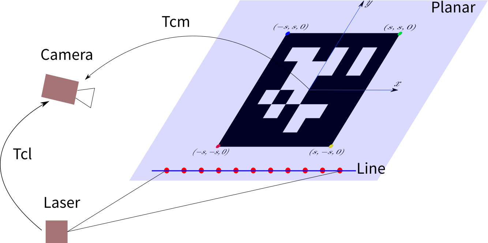
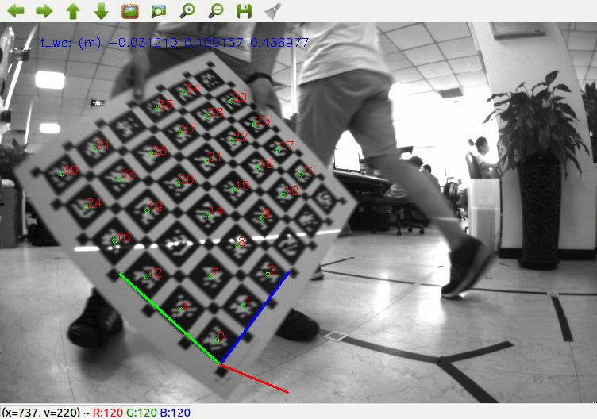
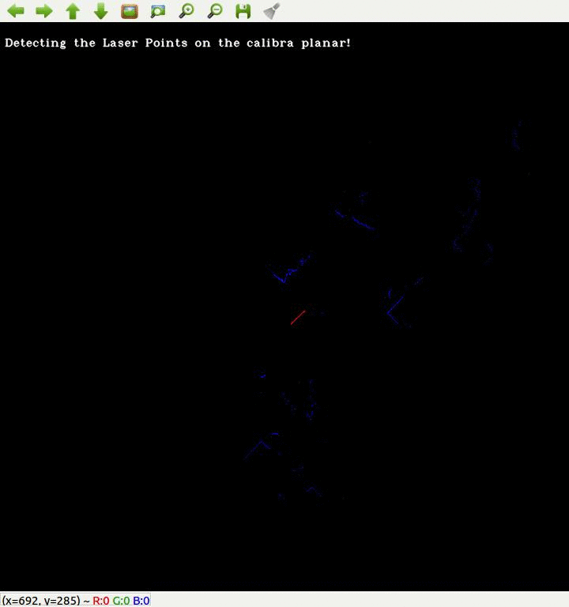

## New Calibra Tool
### 1. 介绍
这是一个基于 ROS 的单线激光和相机外参数自动标定代码。标定原理如下图所示，相机通过二维码估计标定板平面在相机坐标系下的平面方程，由于激光点云落在平面上，将点云通过激光坐标系到相机坐标系的外参数 $T_{cl}$  转换到相机坐标系，构建点到平面的距离作为误差，使用非线性最小二乘进行求解。


### 2. 特征
1. **支持多 April tag 格式**。 可以选择多 apriltag 的标定板 ( [kalibr_tag.pdf](doc/april_6x6_80x80cm_A0.pdf) ) 或者自己打印一个 apriltag 做标定板([apriltag.pdf](/doc/apriltags1-20.pdf))。
2. **支持多种相机模型**。**radial-tangential (radtan)** : (*distortion_coeffs*: [k1 k2 r1 r2]); **equidistant (equi)**:*distortion_coeffs*: [k1 k2 k3 k4]). More info please visit [kalibr website](https://github.com/ethz-asl/kalibr/wiki/supported-models).
3. **激光线自动检测，无须手标**。会自动提取激光线中落在标定板上的激光点，前提是标定板在激光正前方 120 度范围内，并且激光前方 2m 范围内只会存在一个连续的直线线段，所以请你在空旷的地方采集数据，不然激光数据会提取错误。
4. **利用标定板的边界约束，标定结果更加准确**。这个是隐藏的功能，暂时未对外开放接口，需要你修改代码。

### 3. 编译方法

```c++
mkdir LaserCameraCal_ws
mkdir ../src
cd src
git clone https://github.com/MegviiRobot/CamLaserCalibraTool
cd ..
catkin_make -DCMAKE_BUILD_TYPE=Release
```

### 4. 运行

#### 4.1 运行前的准备
请配置好 config/calibra_config.yaml 文件，里面有**相机模型参数，rosbag 数据包的名字和保存路径，相机模型以及标定板的尺寸和类型等等。** 具体请参考对应的 config.yaml。

采集激光数据制作 rosbag，请将标定板放于激光和相机前方 0.3m ~ 1.5m 左右，充分运动标定板（各个轴，各个角度，各个距离和高度都充分运动）。


#### 4.2 先运行 kalibr 检测图像二维码
会把相机和标定板之间的姿态保存成一个 txt，用于后续标定。
```c++
cd LaserCameraCal_ws
source devel/setup.bash
roslaunch lasercamcal_ros kalibra_apriltag.launch 
```

#### 4.3 再运行激光视觉外参数标定代码
会自动检测激光在标定板上的线段，并完成标定和保存结果。
```c++
roslaunch lasercamcal_ros calibra_offline.launch 
```
激光线条的自动获取如下图所示，其中<font color = red>红色部分</font>为激光检测到的标定板线段，请注意保持激光前方是空旷区域：



#### 4.4 验证结果
```c++
roslaunch lasercamcal_ros debug.launch 
rosbag play data.bag
```
运行 debug 工具，看激光光条和图像是否对齐的比较好。


## 5. TODO

1. 支持修改相机采样间隔？？？ 还是说采用自动判断信息熵？
2. 

## 6. Authors

1. Yijia He, if you have any question, please contact heyijia at megvii dot com
2. XiZhen Xiao
3. Xiao Liu, [his homepage](http://www.liuxiao.org/)

## 7. Ref:

2004, Qilong Zhang, Extrinsic Calibration of a Camera and Laser Range Finder (improves camera calibration).